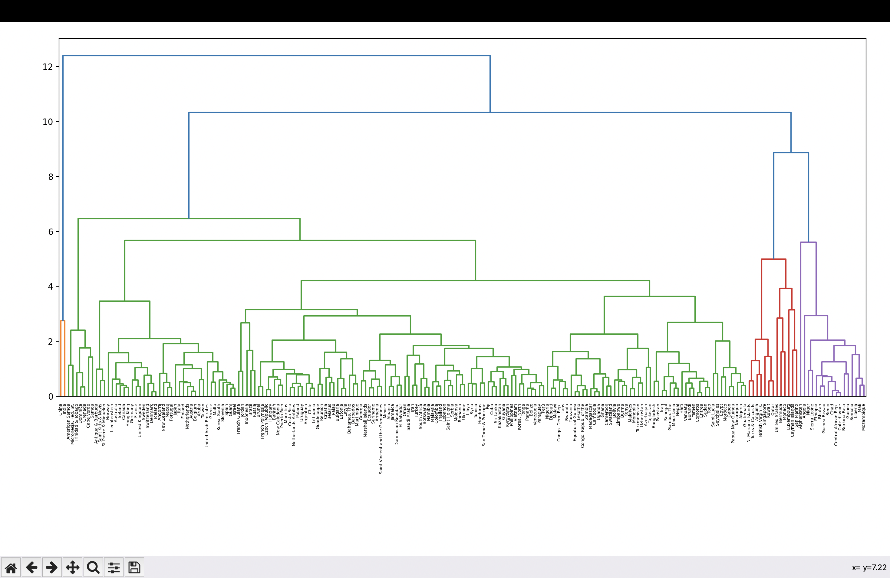

# Hierarchical-Clustering

This project takes in a csv file called countries.csv and helps analyze the socioeconomic situations of each country on the list. It then visualizes the relations between similar socioeconomic situations in different countries by producing a dendrogram as shown below. 

Above we see the result of agglomerative hierarchical clustering, a common technique in unsupervised machine learning. Through this dendrogram, we can identify which countries have similar socioeconomic situations and which groups of countries have similar socioeconomic situations. 
